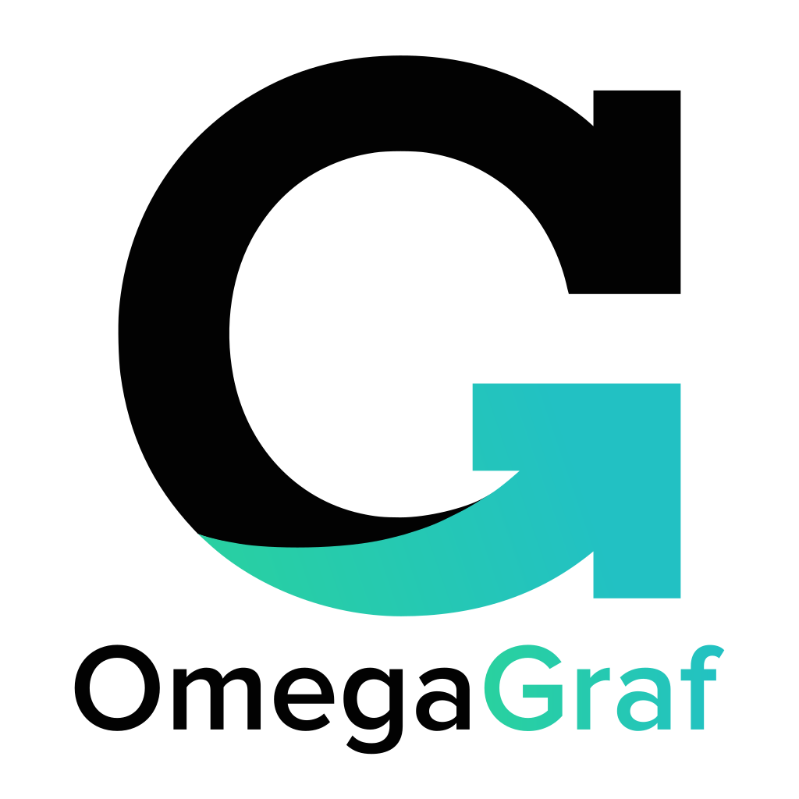
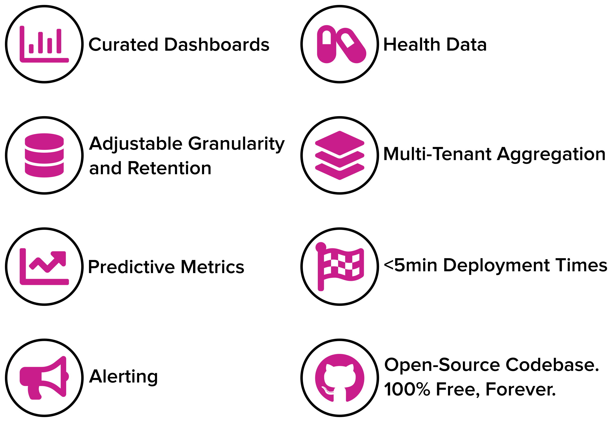
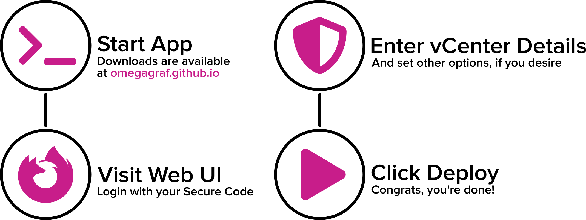
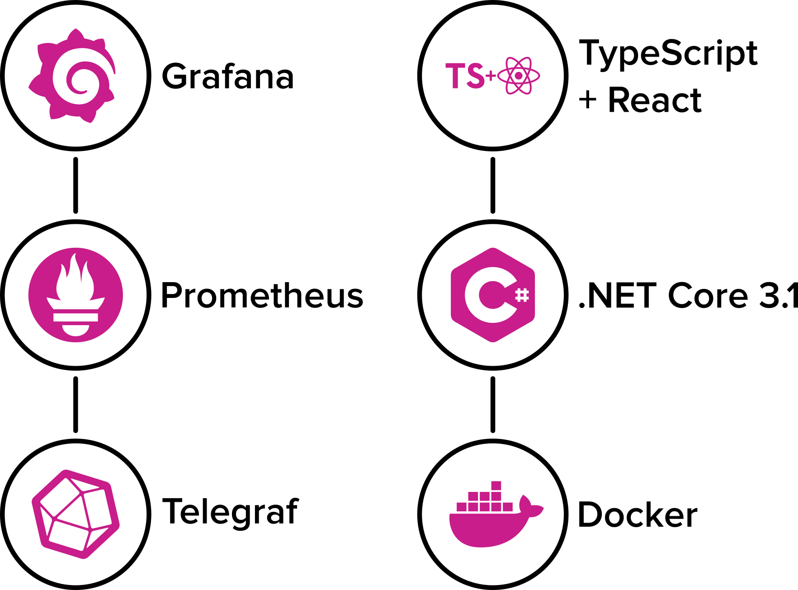

  

## Overview

OmegaGraf is a **vCenter monitoring deployment solution** that is incredibly light, lightning fast, and dead simple. Through a web interface, users may configure and deploy an entirely open-source and containerized software stack.

## Features

In minutes, OmegaGraf provides the following features and more:

  

## Requirements

- Linux or Windows
- Docker CE

## Using OmegaGraf

  

1. Run OmegaGraf application
2. Visit printed URL and enter secure code
3. If you're just testing, check 'Use simulation'
4. Click 'Deploy'

After your deployment completes, you may start using the monitoring stack by visiting Grafana at `http://{hostname}:3000`, or whatever port you chose in the deployment options, and entering `admin`/`admin`. You will be prompted to set a new password on first login.

## SSL

To run OmegaGraf with SSL, you will need to generate a certificate. To generate a self-signed cert, you can install the dotnet-sdk and run `dotnet dev-certs https`.

## Reconfigure & Redeploy

To make changes to any container created by OmegaGraf, you can run with the `--reset` switch. This will remove the containers, but will not delete any data (e.g. time series data, custom dashboards/datasources). You may then re-run the deployment process without issue. Note that currently, we cannot configure Grafana if you have changed the default password. A fix for this is coming soon.

## Comparison

OmegaGraf was inspired by several other products. We thought we could build on some of their accomplishments, any create something that was more dynamic, simpler to use, and easier to maintain.

|Feature|OmegaGraf|SexiGraf|
|-------|---------|--------|
|Containerized| :heavy_check_mark: | :heavy_multiplication_x: |
|Integration with existing products| :heavy_check_mark: | :heavy_multiplication_x: |
|Removable after deployment| :heavy_check_mark: | :heavy_multiplication_x: |
|Self-Monitoring| :heavy_check_mark: | :heavy_check_mark: |
|Collection| Telegraf | Perl |
|TSDB| Prometheus | Graphite |
|Display| Grafana | Modified Grafana |

## Philosophy

* OmegaGraf should only serve as a way to configure and deploy other products.
  * OmegaGraf should make no unsupported changes to any products in the stack.
  * OmegaGraf should support upgrading each individual container at-will, e.g. via Watchtower.
  * While other solutions fall behind on patches, OmegaGraf's deployments should always be up-to-date.
* OmegaGraf should run only during the deployment phase, and should take no actions in any other circumstance.
  * Users should feel free to `rm OmegaGraf.sh` after deploying.
* While the UI is a core tenant, users should always have the option to deploy with OmegaGraf using code.

## Credits

OmegaGraf uses the following technologies:

  

With assets from [Font Awesome](https://fontawesome.com/), [Proxima Nova](https://www.marksimonson.com/fonts/view/proxima-nova), and [Bootstrap](https://getbootstrap.com/) via [React Bootstrap](https://react-bootstrap.github.io/).

View all our dependencies on [libraries.io](https://libraries.io/github/OmegaGraf/OmegaGraf).
