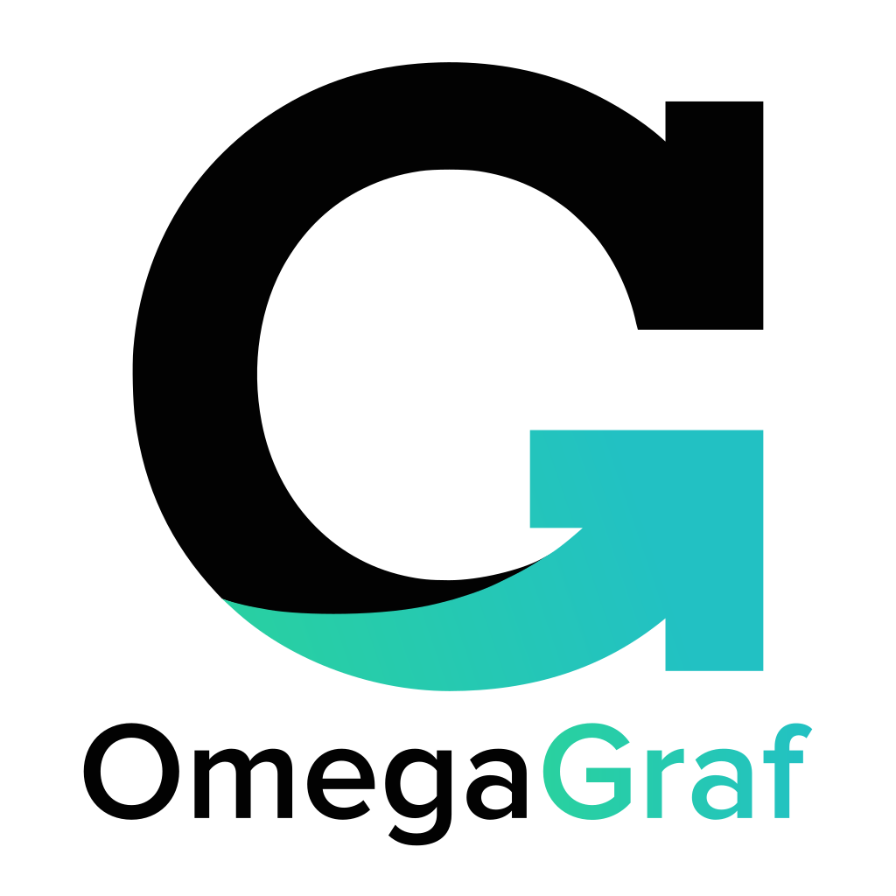
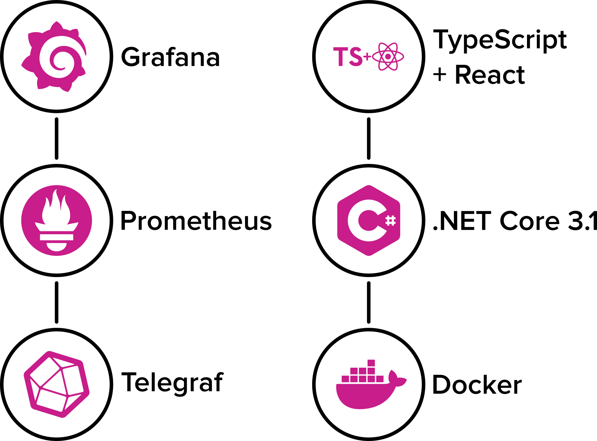

  

<h2 align="center">Rapid, UI-driven vCenter Monitoring Deployment</h2>

  
  
  
  
  

OmegaGraf is a **vCenter monitoring deployment solution** that is incredibly light, lightning fast, and dead simple. Through a web interface, users may configure and deploy an entirely open-source and containerized software stack.

## Expo

OmegaGraf will be showcased in UC's [IT Expo](https://cech.uc.edu/soitexpo.html), April 14, 2020.

## Getting Started

- **[Getting Started](docs/getting-started.md)**
- [Design](docs/architecture.md)

## Features

- Deploys a Telegraf, Prometheus and Grafana stack in just minutes.
- Simple [React user interface](ui) to manage configuration and deployment.
- Suite of arguments and options to customize behavior.
- Deserializes and actions on configuration as JSON data.
- API documented via the OpenAPI Specification.
- Fully testable through the [vCenter Simulator](https://github.com/OmegaGraf/docker-vcsim) container.
- Automatically configures Grafana and adds a set of [curated dashboards](grafana).
- Can be set up with just one command using our [install script](install).

## Philosophy

- OmegaGraf should only serve as a way to configure and deploy other products.
  - OmegaGraf should make no unsupported changes to any products in the stack.
  - OmegaGraf should support upgrading each individual container at-will, e.g. via Watchtower.
  - While other solutions fall behind on patches, OmegaGraf's deployments should always be up-to-date.
- OmegaGraf should run only during the deployment phase, and should take no actions in any other circumstance.
  - Users should feel free to `rm OmegaGraf` after deploying.
- While the UI is a core tenant, users should always have the option to deploy with OmegaGraf using code.

## Credits

OmegaGraf uses the following technologies:

  

With assets from [Font Awesome](https://fontawesome.com/), [Proxima Nova](https://www.marksimonson.com/fonts/view/proxima-nova), and [Bootstrap](https://getbootstrap.com/) via [React Bootstrap](https://react-bootstrap.github.io/).

View all our dependencies on [libraries.io](https://libraries.io/github/OmegaGraf/OmegaGraf).

## Contributing

Check out the [Contributing Guide](CONTRIBUTING.md).

## Contributors ✨

Thanks goes to these wonderful people ([emoji key](https://allcontributors.org/docs/en/emoji-key)):

<!-- ALL-CONTRIBUTORS-LIST:START - Do not remove or modify this section -->
<!-- prettier-ignore-start -->
<!-- markdownlint-disable -->
<table>
  <tr>
    <td align="center"><a href="https://github.com/MacroPower"> <b>Jacob Colvin</b></a> <a href="https://github.com/OmegaGraf/OmegaGraf/commits?author=MacroPower" title="Code">💻</a> <a href="#infra-MacroPower" title="Infrastructure (Hosting, Build-Tools, etc)">🚇</a> <a href="#maintenance-MacroPower" title="Maintenance">🚧</a></td>
    <td align="center"><a href="https://github.com/curriemw"> <b>Matt Currie</b></a> <a href="#projectManagement-curriemw" title="Project Management">📆</a> <a href="#design-curriemw" title="Design">🎨</a></td>
    <td align="center"><a href="https://github.com/xvDylan"> <b>xvDylan</b></a> <a href="#security-xvDylan" title="Security">🛡️</a> <a href="https://github.com/OmegaGraf/OmegaGraf/commits?author=xvDylan" title="Tests">⚠️</a></td>
  </tr>
</table>

<!-- markdownlint-enable -->
<!-- prettier-ignore-end -->
<!-- ALL-CONTRIBUTORS-LIST:END -->

This project follows the [all-contributors](https://github.com/all-contributors/all-contributors) specification. Contributions of any kind welcome!
