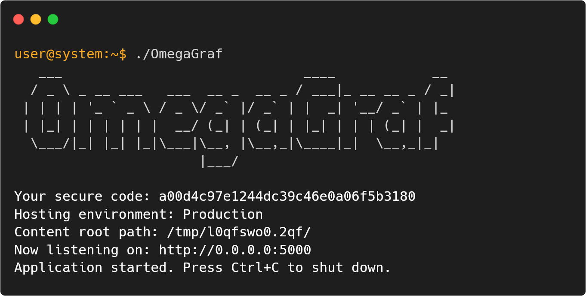
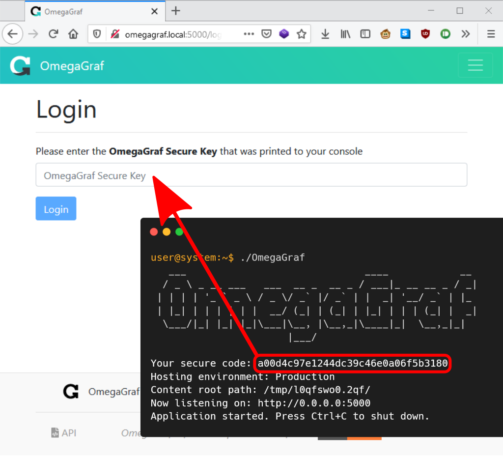
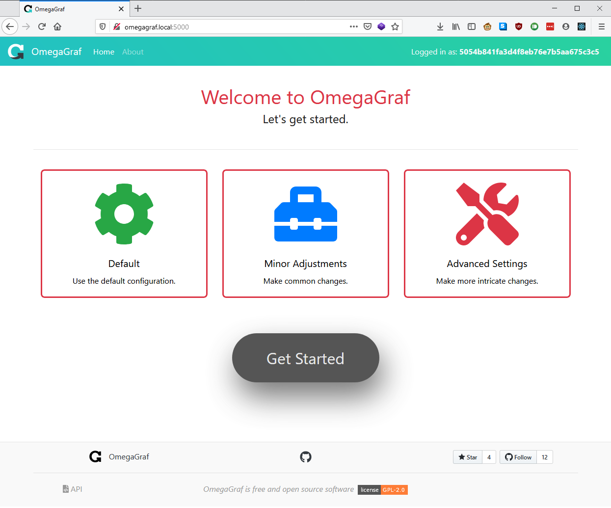
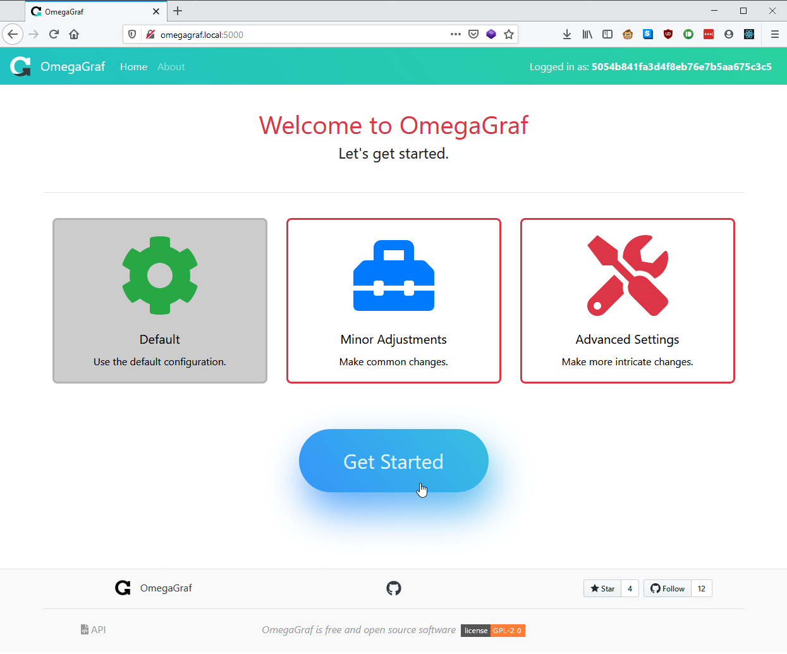
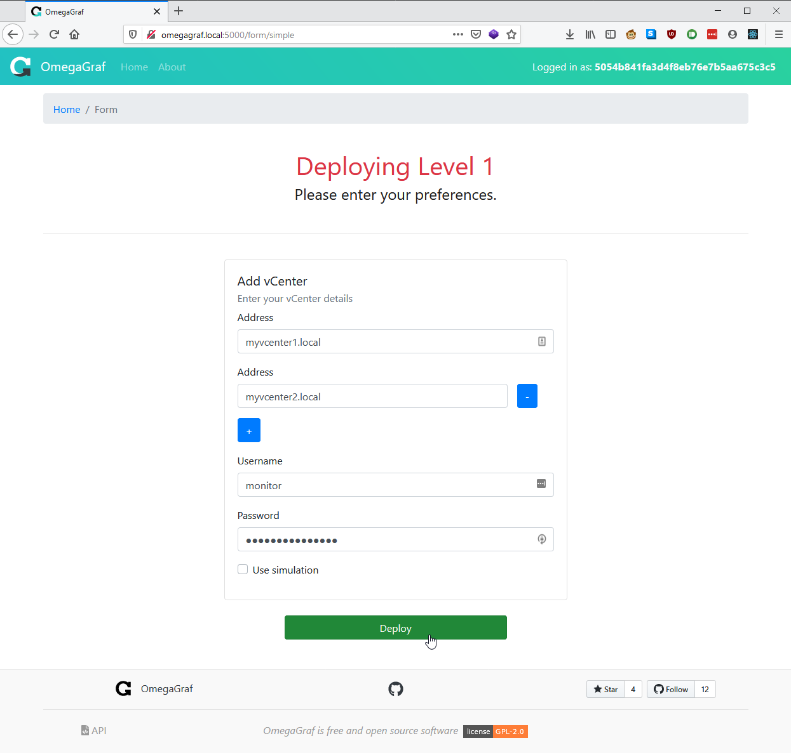
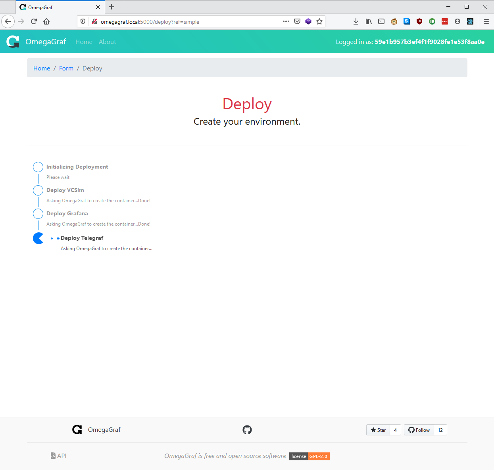
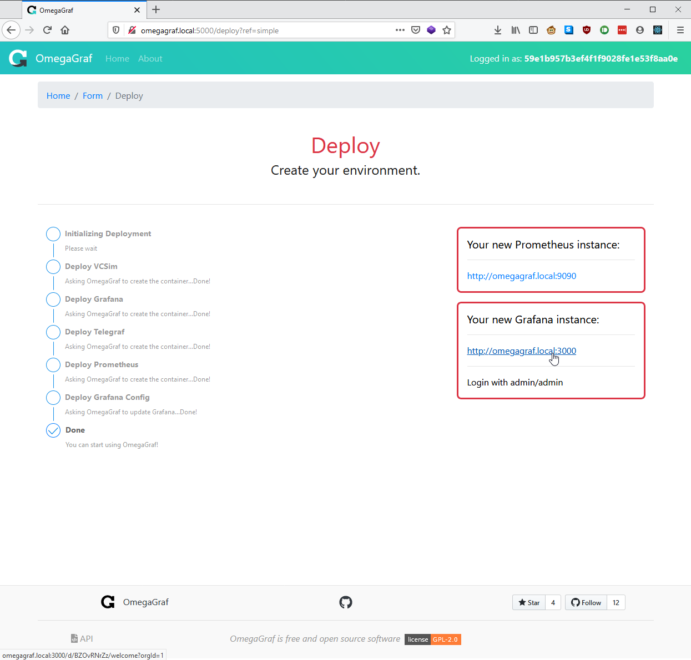
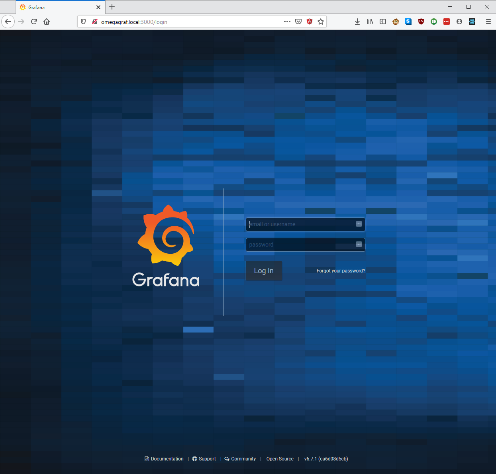
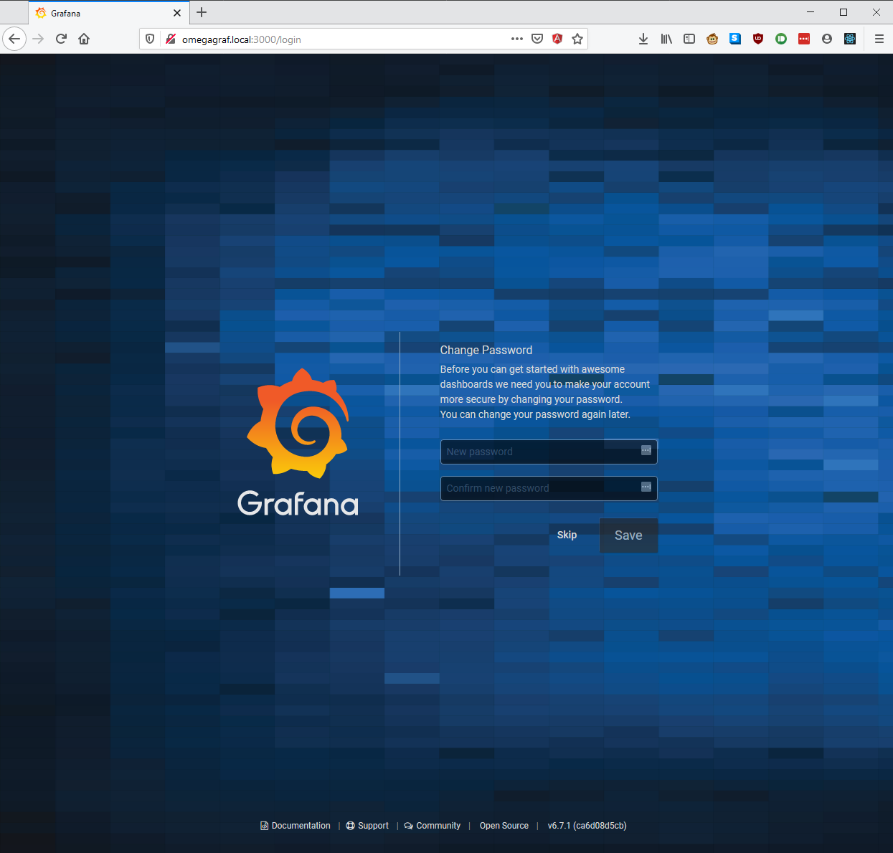
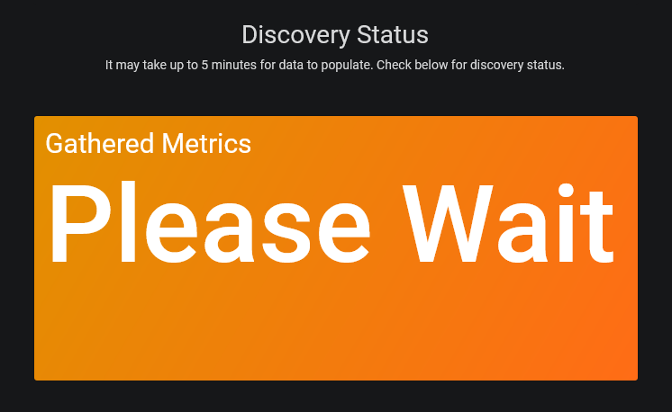

# Walkthrough

For help getting OmegaGraf ready for your first deployment, see [Getting Started](getting-started.md).

## Start OmegaGraf

  

## Login

Visit the UI at the printed interface:port, and enter the printed code.

  

## Visit Homepage

### Homepage

  

### Option Selection

  

## Start Deployment

Enter your details, or click "Use Simulation", and start the deployment.

  

## Wait for Completion

  

## Visit Grafana

  

## Login

  

## Change Password

  

## Wait for Metrics

The Telegraf plugin is configured to gather metrics at intervals of 1 and 5 minutes, depending on metric type. You may need to wait for several minutes for all panels to begin working. Our welcome dashboard shows how many objects we have currently loaded.

  

## Enjoy

After the aformentioned panel is green, you can start using the dashboards we have added for you. Feel free to remove the OmegaGraf binary.
